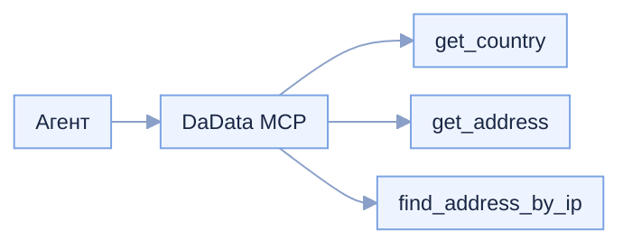

# DaData Local MCP

Локальный MCP-сервер на C# / .NET 8. Отдаёт агенту в Cursor три инструмента по API [DaData](https://dadata.ru/): страна по названию или коду, адрес по координатам, город по IP. **Это собственное решение в репозитории**, не облачный MCP с сайта DaData.




## Как IDE подключается к MCP и что такое tool

Cursor запускает этот сервер как дочерний процесс и говорит с ним по **stdio**: JSON-RPC идёт через stdin/stdout, логи — только в stderr. При подключении IDE выполняет handshake (`initialize`), забирает метаданные сервера (`dadata-mcp` 1.0.0) и список tools. Дальше агент в чате может вызвать tool по имени: передаёт аргументы по JSON-схеме, сервер ходит в DaData и возвращает структурированный JSON.

**Tool** здесь — метод с атрибутом `[McpServerTool]`: понятное имя, описание, схема входных параметров и объектный результат. Три tool: `get_country`, `get_address`, `find_address_by_ip`. API-ключ в схему tool не входит и в аргументах не передаётся.

## API-ключ: форма в чате, без .env

Ключ DaData нигде на диске не хранится — ни в `.env`, ни в переменных окружения. Он живёт только в памяти процесса MCP. Источник ключа один — форма в чате Cursor (MCP elicitation, режим `form`).

При включении MCP форма **не** открывается: процесс стартует без ключа и просто ждёт вызовов. Форма открывается **при вызове любого tool** через общий метод `EnsureApiKey`, если в сессии нет живого ключа: это первый вызов в новом процессе, вызов после сброса сессии или после закрытой формы.

```mermaid
flowchart TD
    toolCall[Вызов tool] --> gate[EnsureApiKey]
    gate --> alive{Сессия жива и младше суток}
    alive -->|да| ready[Ключ уже есть]
    alive -->|нет| form[Форма в чате]
    form -->|accept| mem[В память сессии]
    form -->|decline/cancel| stop[Ключ не сохранён]
    ready --> call[Запрос в DaData]
    mem --> call
```

- Хранение — singleton в памяти процесса, TTL 24 часа. Вызов tool в последний час продлевает сессию ещё на 24 часа. Ни файла, ни базы, ни `.env`. В stderr ключ не пишется.
- Заголовок `Authorization: Token …` ставится на каждый запрос из текущей сессии — после повторного ввода уходит уже новый токен.
- Сессия сбрасывается: при новом процессе MCP (включение, перезапуск окна Cursor, повторный запуск), при выключении и отключении сервера (процесс завершается по EOF stdin, дополнительно `ApiKeySession.Clear()` при остановке хоста), через 24 часа без продления, при ответе DaData `401`.
- Продление: если до конца сессии осталось не больше часа, вызов tool сдвигает срок на 24 часа от текущего момента. Срок проверяется лениво, при обращении к ключу.
- Если форму закрыли при вызове tool, ключ не сохраняется, вызов завершается коротким текстом ошибки без запроса в DaData, следующий вызов снова откроет форму.
- Параллельные вызовы без ключа ждут одну форму. Ожидание ответа формы (и очереди за чужой формой) ограничено 3 минутами: по таймауту вызов завершается ошибкой, следующий откроет форму заново.
- Сроки можно переопределить без пересборки (в `env` или аргументах запуска в `mcp.json`, ключ там не хранится): `DADATA_SESSION_TTL_MINUTES` (24 ч по умолчанию), `DADATA_SESSION_RENEW_MINUTES` (порог продления, 60 по умолчанию), `DADATA_FORM_TIMEOUT_SECONDS` (180 по умолчанию). Нужно, например, чтобы проверить истечение сессии за пару минут.

## Требования

- [.NET 8 SDK](https://dotnet.microsoft.com/download/dotnet/8.0)
- Аккаунт [DaData](https://dadata.ru/) с **API-ключом** (вводится в форме в чате, не в файлах)

Все три метода идут в [подсказки](https://dadata.ru/api/suggest/country/) (`suggestions.dadata.ru`): до 10 000 запросов в день бесплатно. Платный cleaner / стандартизация адреса не используется.

## Сборка

```bash
dotnet restore
dotnet build
```

Сборка обязательна до включения MCP: Cursor запускает уже собранный DLL через `dotnet exec`.

## Docker

Тот же stdio-сервер в контейнере. HTTP-порта нет: Cursor запускает контейнер и говорит с процессом через stdin/stdout. API-ключ по-прежнему только в памяти процесса — в `environment`, volume и аргументы `docker run` его передавать не нужно.

Нужен запущенный Docker Desktop.

```bash
docker compose build
```

Подключение в Cursor: скопируйте `[.cursor/mcp.docker.json.example](.cursor/mcp.docker.json.example)` в `[.cursor/mcp.json](.cursor/mcp.json)` (или замените блок сервера). Образ должен быть собран до включения MCP.

```json
"command": "docker",
"args": ["run", "-i", "--rm", "--init", "dadata-mcp:latest"]
```

`-i` держит stdin открытым, иначе JSON-RPC оборвётся. Флаг `-t` не ставьте: TTY портит кадры протокола. Логи по-прежнему идут в stderr.

Ручная проверка handshake: запустите контейнер и, не закрывая stdin, отправьте одну строку. Ответ придёт в тот же терминал, пока ввод открыт. Затем Ctrl+C.

```bash
docker run -i --rm --init dadata-mcp:latest
```

```json
{"jsonrpc":"2.0","id":1,"method":"initialize","params":{"protocolVersion":"2024-11-05","capabilities":{},"clientInfo":{"name":"smoke","version":"0.0.1"}}}
```

В ответе `serverInfo.name` равен `dadata-mcp`, версия `1.0.0`. Логи `info:` идут в stderr и протокол не затирают.

## Как включить в Cursor

1. Соберите проект: `dotnet build`.
2. Пример конфига MCP: `[.cursor/mcp.json.example](.cursor/mcp.json.example)`. Рабочий файл: `[.cursor/mcp.json](.cursor/mcp.json)`. Ключей в конфиге нет.
3. Cursor → **Settings → MCP**. Включите сервер. Форма при включении не открывается.
4. Вызовите любой tool (например, `get_country`): в чате откроется форма ввода API-ключа DaData. Ключ попадёт в память процесса на 24 часа. Если форму закрыть, она снова откроется при следующем вызове tool.
5. В чате агента проверьте, что видны tools `get_country`, `get_address`, `find_address_by_ip`. Проверочные запросы: `[docs/verification/queries.md](docs/verification/queries.md)`.

## Безопасность

- API-ключ хранится только в памяти процесса (TTL 24 часа). Ни `.env`, ни переменных окружения, ни файлов. В исходниках, в `mcp.json`, в аргументах tools и в логах stderr ключа нет.
- Единственный способ задать ключ — форма в чате (MCP elicitation, режим `form`). Агент ключ не видит и в промпт не получает.
- Tools не читают файлы диска и не запускают команды ОС. Область доступа — только HTTP к `suggestions.dadata.ru`.
- Логи пишут имя tool, входные параметры и `success`/`error`, без ключей.


## Tool outputs contract

Контракт результата задан типами в `[src/DadataMcp.Server/Models/ToolResults.cs](src/DadataMcp.Server/Models/ToolResults.cs)` (L1–L43). MCP сериализует объекты в JSON (camelCase), это не «просто текст».

### `get_country`

Вход: `query` (string, до 300 символов); опционально `count` (1–20, по умолчанию 10). Поиск по названию, цифровому коду, альфа-2 и альфа-3 ([документация](https://dadata.ru/api/suggest/country/)).

```json
{
  "suggestions": [
    {
      "value": "Таиланд",
      "code": "764",
      "alfa2": "TH",
      "alfa3": "THA",
      "nameShort": "Таиланд",
      "name": "Королевство Таиланд"
    }
  ],
  "message": null
}
```

Если совпадений нет: `suggestions` — пустой массив, в `message` пояснение.

### `get_address`

Вход: `lat`, `lon`; опционально `count` (1–20, по умолчанию 10), `radiusMeters` (1–1000, по умолчанию 100).

```json
{
  "suggestions": [
    {
      "value": "г Москва, ул Сухонская, д 11",
      "unrestrictedValue": "127642, г Москва, ул Сухонская, д 11",
      "postalCode": "127642",
      "country": "Россия",
      "region": "г Москва",
      "city": null,
      "street": "ул Сухонская",
      "house": "11",
      "geoLat": "55.878",
      "geoLon": "37.653",
      "fiasId": "..."
    }
  ]
}
```


### `find_address_by_ip`

Вход: `ip` (IPv4 или IPv6).

```json
{
  "location": {
    "value": "г Краснодар",
    "unrestrictedValue": "350000, Краснодарский край, г Краснодар",
    "postalCode": "350000",
    "city": "г Краснодар"
  },
  "message": null
}
```

Если город не определён: `{ "location": null, "message": "Город по указанному IP определить не удалось." }`.

## Подтверждения ссылками на код


### MCP-сервер

Подъём хоста, метаданные и регистрация tools: `[src/DadataMcp.Server/Program.cs](src/DadataMcp.Server/Program.cs)` **L31–L47**.

Клиент DaData: `[src/DadataMcp.Server/Client/DaDataClient.cs](src/DadataMcp.Server/Client/DaDataClient.cs)` **L28–L99**. Перед POST в stderr пишутся тело запроса и сырой JSON ответа.

### Инструменты


| Tool                 | Реализация                                                                  | Логи вызова                  |
| -------------------- | --------------------------------------------------------------------------- | ---------------------------- |
| `get_country`        | `[DaDataTools.cs](src/DadataMcp.Server/Tools/DaDataTools.cs)` **L21–L76**   | L38, L44, L50, L59, L68, L73 |
| `get_address`        | `[DaDataTools.cs](src/DadataMcp.Server/Tools/DaDataTools.cs)` **L78–L126**  | L98, L104, L113, L118, L123  |
| `find_address_by_ip` | `[DaDataTools.cs](src/DadataMcp.Server/Tools/DaDataTools.cs)` **L128–L173** | L142, L149, L157, L165, L170 |


Общий вывод в stderr: `[src/DadataMcp.Server/Logging/ToolCallLog.cs](src/DadataMcp.Server/Logging/ToolCallLog.cs)` **L12–L42**.

На каждый вызов, который дошёл до DaData, три строки: имя tool, JSON тела POST (`dadata_request`) и сырой JSON ответа (`dadata_response`). Ключ API в лог не попадает. Строка `status=` — итог самого tool, в том числе если запрос в DaData не отправлялся.

Пример вывода:

```text
[get_country] dadata_request={"query":"та","count":10}
[get_country] dadata_response http=200 {"suggestions":[...]}
[get_country] params={"query":"та","count":10} status=success
[get_address] dadata_request={"lat":55.878,"lon":37.653,"count":10,"radius_meters":100}
[get_address] dadata_response http=200 {"suggestions":[...]}
[get_address] params={"lat":55.878,"lon":37.653,"count":10,"radiusMeters":100} status=success
[find_address_by_ip] dadata_request={"ip":"46.226.227.20"}
[find_address_by_ip] dadata_response http=200 {"location":{...}}
[find_address_by_ip] params={"ip":"46.226.227.20"} status=success
[get_country] params={"query":"...","count":10} status=error http=401
```


### Агент вызывает нужный tool

Пример запроса: «Какая страна по запросу та?»

- ожидаемый tool: `get_country`
- фактическое подтверждение: лог stderr в формате выше; скриншот/trace после живого прогона — `[docs/verification/](docs/verification/)`


## Структура

```text
src/DadataMcp.Server/          MCP-хост, клиент DaData, tools, сессия ключа
Dockerfile                    образ stdio-сервера (без порта и без ключа)
docker-compose.yml            сборка образа dadata-mcp:latest
.cursor/mcp.json              конфиг Cursor без секретов
.cursor/mcp.json.example      запуск через dotnet exec
.cursor/mcp.docker.json.example  запуск собранного образа через docker run -i
docs/verification/            шаблон проверочных запросов
```

